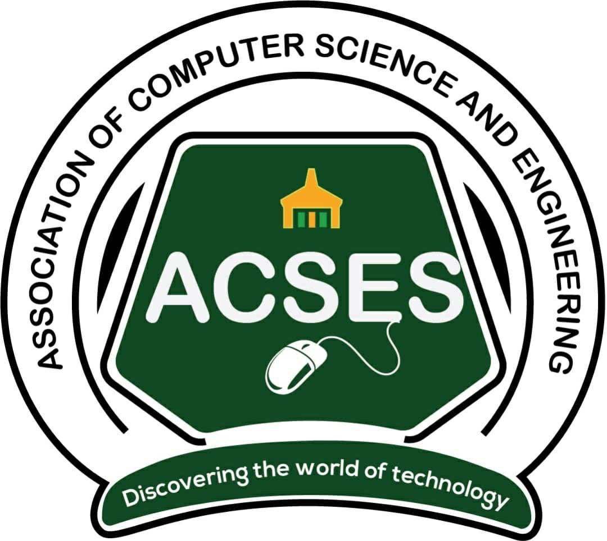

# ACSES Official Website

<div align="center">



**Official website for the Association of Computer Science and Engineering Students (ACSES)**

[](https://acses-srid.vercel.app)
[](https://github.com/ACSES-SRID/acses-website)
[](LICENSE)

[Live Demo](https://acses-srid.vercel.app) • [Report Bug](https://github.com/ACSES-SRID/acses-website/issues) • [Request Feature](https://github.com/ACSES-SRID/acses-website/issues)

</div>

---

## 📋 Table of Contents

- [About](#about)
- [Features](#features)
- [Tech Stack](#tech-stack)
- [Getting Started](#getting-started)
  - [Prerequisites](#prerequisites)
  - [Installation](#installation)
  - [Development](#development)
  - [Building for Production](#building-for-production)
- [Project Structure](#project-structure)
- [Available Scripts](#available-scripts)
- [Contributing](#contributing)
- [Code Style Guidelines](#code-style-guidelines)
- [Deployment](#deployment)
- [Support](#support)
- [License](#license)

---

## 🎯 About

The ACSES-SRID Official Website serves as the digital hub for the Association of Computer Science and Engineering Students in SRID-UMaT. This modern, responsive web application provides students, faculty, and visitors with comprehensive information about ACSES programs, events, leadership, resources, ACSES-Store, and student projects.

### Key Objectives

- Showcase ACSES programs, events, and initiatives
- Provide easy access to educational resources and materials
- Highlight student projects and achievements
- Facilitate communication between members and leadership
- Promote ACSES merchandise and store offerings

---

## ✨ Features

- **Responsive Design**: Fully optimized for desktop, tablet, and mobile devices
- **Progressive Web App (PWA)**: Installable with offline capabilities
- **Modern UI/UX**: Built with Tailwind CSS and Material-UI components
- **Smooth Animations**: Enhanced user experience with Framer Motion
- **Dynamic Routing**: Client-side routing with React Router
- **Performance Optimized**: Lazy loading, code splitting, and image optimization
- **Analytics Integration**: Vercel Analytics for visitor insights
- **Custom Branding**: ACSES green and yellow color scheme throughout

### Pages & Sections

- **Home**: Hero section, welcome message, statistics, news, and events
- **Leadership**: Executive team and organizational structure
- **Programs**: Academic programs and initiatives
- **Resources**: Educational materials and learning resources
- **Store**: ACSES merchandise and products
- **Gallery**: Photo gallery of events and activities
- **Student Projects**: Showcase of member projects and achievements

---

## 🛠 Tech Stack

### Core Technologies

- **React 18.3.1** - UI library for building component-based interfaces
- **Vite 6.0.5** - Next-generation frontend build tool
- **React Router DOM 7.1.1** - Declarative routing for React applications
- **Tailwind CSS 3.4.17** - Utility-first CSS framework

### UI Libraries & Components

- **Material-UI (MUI) 6.3.1** - React component library
- **Framer Motion 11.15.0** - Animation library
- **Heroicons & Lucide React** - Icon libraries
- **React Icons 5.4.0** - Popular icon packs

### Additional Features

- **Vite PWA Plugin** - Progressive Web App capabilities
- **Workbox** - Service worker and caching strategies
- **Vercel Analytics** - Web analytics and insights
- **Recharts** - Charting library for data visualization
- **Date-fns** - Modern date utility library

### Development Tools

- **ESLint** - Code linting and quality checks
- **PostCSS & Autoprefixer** - CSS processing
- **Vercel** - Deployment and hosting platform

---

## 🚀 Getting Started

### Prerequisites

Before you begin, ensure you have the following installed:

- **Node.js** (v18.0.0 or higher)
- **npm** (v9.0.0 or higher) or **yarn** (v1.22.0 or higher)
- **Git** for version control

### Installation

1. Clone the repository

```bash
git clone https://github.com/ACSES-SRID/acses-website.git
cd acses-website
```

2. Install dependencies

```bash
npm install
```

or using yarn:

```bash
yarn install
```

### Development

Start the development server with hot module replacement (HMR):

```bash
npm run dev
```

The application will be available at `http://localhost:5173`

### Building for Production

Create an optimized production build:

```bash
npm run build
```

Preview the production build locally:

```bash
npm run preview
```

---

## 📁 Project Structure

```
acses-website/
├── public/                  # Static assets
│   ├── images/             # Image assets
│   ├── logo/               # ACSES logos
│   └── Screenshots/        # Application screenshots
├── src/
│   ├── assets/             # Source assets (images, fonts, etc.)
│   ├── components/         # Reusable React components
│   │   ├── about/
│   │   ├── contact/
│   │   ├── events/
│   │   ├── footer/
│   │   ├── hero-section/
│   │   ├── navbar/
│   │   ├── news/
│   │   ├── patrons/
│   │   ├── programs/
│   │   ├── resources/
│   │   ├── statistics/
│   │   ├── store/
│   │   ├── welcome/
│   │   └── xlogo/
│   ├── data/               # Static data and constants
│   ├── layouts/            # Layout components
│   ├── pages/              # Page components
│   │   ├── error/
│   │   ├── executives/
│   │   ├── gallery/
│   │   ├── home/
│   │   ├── leadership/
│   │   ├── programs/
│   │   ├── resources/
│   │   ├── store/
│   │   └── student-projects/
│   ├── App.jsx             # Main application component
│   ├── main.jsx            # Application entry point
│   ├── index.css           # Global styles
│   └── service-worker.js   # PWA service worker
├── .gitignore
├── eslint.config.js        # ESLint configuration
├── index.html              # HTML entry point
├── package.json            # Project dependencies
├── postcss.config.js       # PostCSS configuration
├── tailwind.config.js      # Tailwind CSS configuration
├── vercel.json             # Vercel deployment config
└── vite.config.js          # Vite configuration
```

---

## 📜 Available Scripts

| Command | Description |
|---------|-------------|
| `npm run dev` | Start development server with HMR |
| `npm run build` | Build for production |
| `npm run preview` | Preview production build locally |
| `npm run lint` | Run ESLint to check code quality |

---

## 🤝 Contributing

We welcome contributions from all ACSES members and the community! Here's how you can help:

### Contribution Workflow

1. **Fork the repository**

2. **Create a feature branch**
   ```bash
   git checkout -b feature/your-feature-name
   ```

3. **Make your changes**
   - Write clean, maintainable code
   - Follow the code style guidelines
   - Test your changes thoroughly

4. **Commit your changes**
   ```bash
   git commit -m "feat: add your feature description"
   ```

5. **Push to your branch**
   ```bash
   git push origin feature/your-feature-name
   ```

6. **Open a Pull Request**
   - Provide a clear description of your changes
   - Reference any related issues
   - Wait for code review and approval

### Commit Message Convention

We follow the [Conventional Commits](https://www.conventionalcommits.org/) specification:

- `feat:` - New feature
- `fix:` - Bug fix
- `docs:` - Documentation changes
- `style:` - Code style changes (formatting, etc.)
- `refactor:` - Code refactoring
- `test:` - Adding or updating tests
- `chore:` - Maintenance tasks

### Reporting Issues

Found a bug or have a feature request? Please [open an issue](https://github.com/ACSES-SRID/acses-website/issues) with:

- Clear title and description
- Steps to reproduce (for bugs)
- Expected vs actual behavior
- Screenshots (if applicable)
- Your environment details

---

## 💅 Code Style Guidelines

### JavaScript/React

- Use functional components with hooks
- Follow React best practices and patterns
- Use meaningful variable and function names
- Keep components small and focused
- Implement proper prop validation

### CSS/Tailwind

- Use Tailwind utility classes when possible
- Follow the custom color scheme (acses-green, acses-yellow)
- Maintain responsive design principles
- Keep custom CSS minimal

### File Organization

- One component per file
- Group related components in folders
- Use index files for cleaner imports
- Keep file names consistent (PascalCase for components)

---

## 🚢 Deployment

The website is automatically deployed to Vercel on every push to the main branch.

### Manual Deployment

1. Install Vercel CLI:
   ```bash
   npm install -g vercel
   ```

2. Deploy:
   ```bash
   vercel
   ```

### Environment Variables

No environment variables are currently required for deployment.

---

## 📞 Support

For questions, issues, or suggestions:

- **GitHub Issues**: [Create an issue](https://github.com/ACSES-SRID/acses-website/issues)
- **Email**: Contact ACSES leadership
- **Website**: [acses-srid.vercel.app](https://acses-srid.vercel.app)

---

## 📄 License

This project is licensed under the MIT License - see the [LICENSE](LICENSE) file for details.

---

## 👥 Maintainers

This project is maintained by the ACSES Web Development Team.

---

## 🙏 Acknowledgments

- ACSES Leadership and Executive Team
- All contributors and community members
- Open source libraries and tools used in this project

---

<div align="center">

**Made with ❤️ by ACSES**

[Website](https://acses-srid.vercel.app) • [GitHub](https://github.com/ACSES-SRID)

</div>

